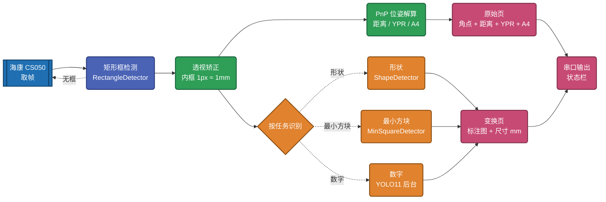
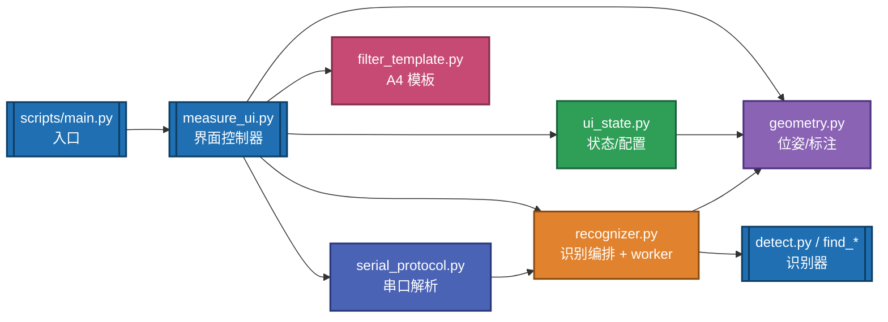
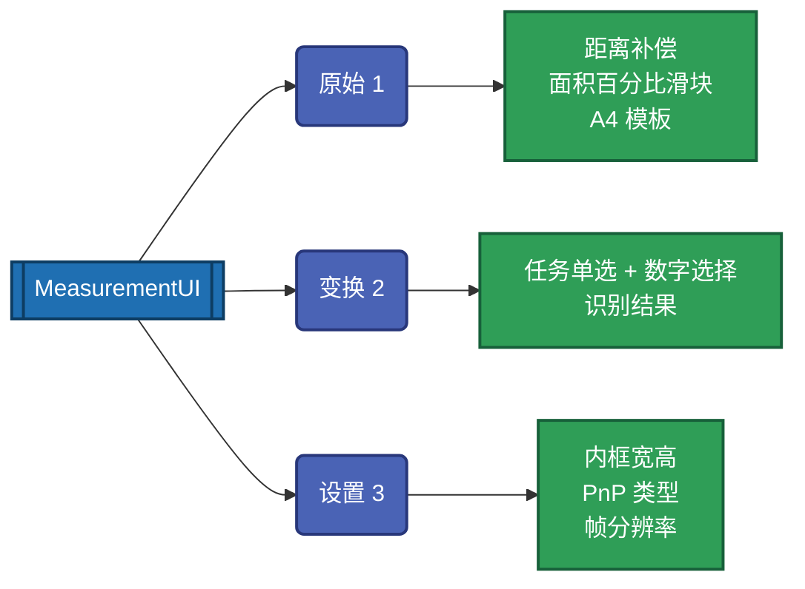

# MonocularRangefinder-NUEDC2025

基于**单目视觉**的目标物测量系统，面向 **2025 年全国大学生电子设计竞赛 C 题**「基于单目视觉的目标物测量装置」。
运行于**地平线 RDK X5**（Linux aarch64）开发板，采用**海康机器人 CS050** 工业相机采集，完成相机标定、矩形框检测、形状/数字/内切圆测量，并通过串口与下位机通信。


-black?style=flat-square)


---

## 目录

- [特性](#特性)
- [系统流程](#系统流程)
- [模块分层](#模块分层)
- [目录结构](#目录结构)
- [界面说明](#界面说明)
- [配置](#配置)
- [启动](#启动)
- [依赖](#依赖)
- [许可](#许可)

## 特性

- **相机标定**：交互式采图，输出内参 / 畸变 / 棋盘格尺寸，支持裁剪区域采集与主点自动平移回整帧坐标系。
- **矩形框检测**：在原帧中按面积、宽高比、内外双轮廓筛选目标纸板，输出 4 个亚像素角点（含卡尔曼滤波平滑）。
- **三类识别任务**：形状（三角形 / 圆形 / 矩形）、最小内切方块、YOLO11 数字（BPU 后台推理，不阻塞界面）。
- **PnP 位姿解算**：解算纸板相对相机的**距离**（含距离补偿）、**YPR 偏航/俯仰/滚转角度**（偏离水平/竖直面）、**A4 比例适宜性**。
- **Tkinter 三页界面**：原始 / 变换 / 设置，控件按页面关联分布，画布随窗口自适应。
- **面积筛选**：以「帧面积百分比」为权威值，跨相机可迁移；界面上叠加 MIN/MAX A4 模板对比检测框。
- **Debug（无下位机）模式**：关闭串口，识别任务由界面自由选择，便于调参。

## 系统流程

每帧主循环：取帧 → 检测矩形 → 透视矫正 → 按任务识别 + PnP 解算 → 渲染 → 串口输出。



> 注：识别任务由**下位机串口命令**（choice 串口 `g...l` 帧内 `as`/`bs`/`d<数字>`）驱动；Debug 模式下改由界面单选按钮自由选择。

## 模块分层

测量状态 / 识别编排 / 串口解析 / 几何标注从 UI 类下沉为独立模块，UI 仅为薄控制器：



## 目录结构

```text
MonocularRangefinder-NUEDC2025/
├── DS_start.sh
├── README.md
├── CHANGELOG.md
├── LICENSE
├── .gitignore
├── DOCS/
│   └── C题_基于单目视觉的目标物测量装置.pdf
├── configs/
│   ├── app.yaml                 # 运行配置（相机/测量/模型/串口/界面）
│   └── camera_calibration.yaml  # 标定结果（内参/畸变/棋盘格）
├── drivers/
│   ├── send_data.py             # 串口发送
│   └── hikrobot/
│       ├── HIK_CAM.py           # 海康相机封装
│       ├── include/
│       └── lib/
│           ├── amd64/libMvCameraControl.so
│           └── arm64/libMvCameraControl.so
├── modules/
│   ├── detect.py                # 矩形框检测
│   ├── filter_template.py       # 帧上叠加 A4 面积筛选参照矩形
│   ├── find_all.py              # 形状识别
│   ├── find_minSquare.py        # 最小内切方块
│   ├── find_numSquare.py        # YOLO11 数字识别（需 BPU）
│   ├── geometry.py              # 纯几何/位姿/帧标注函数
│   ├── get_rgb.py               # 颜色(RGB)提取
│   ├── measure_ui.py            # Tkinter 界面（薄控制器）
│   ├── recognizer.py            # 识别编排 + 数字后台 worker
│   ├── serial_protocol.py       # 串口帧解析
│   └── ui_state.py              # 界面可变状态与配置同步
├── scripts/
│   ├── _bootstrap.py            # 路径注入
│   ├── calibration.py           # 相机标定
│   └── main.py                  # 主程序入口
├── tools/
│   ├── config_loader.py
│   └── hikrobot_paths.py
└── tests/
    ├── test_config_loader.py
    └── test_hikrobot_paths.py
```

## 界面说明

Tkinter 多页界面，随相机实时刷新；页面按钮 `原始(1)` / `变换(2)` / `设置(3)`，控件按页面关联分布：



- **原始(1)**：相机原帧 + 检测矩形外框，标注 PnP 解算的距离（含补偿）、YPR 角度（偏离水平/竖直面）与 A4 比例适宜性。
- **变换(2)**：透视矫正后的内框图 + 识别结果（形状 / 最小方块 / 数字 与尺寸，单位 mm）。
- **滑块补偿**：距离偏移 `camera_offset_mm`、内框真实宽高 `rect_width_mm` / `rect_height_mm`，以及面积筛选上下限（百分比）。
- **PnP 下拉框**：可选 `ITERATIVE` / `EPNP` / `IPPE` / `DLS` / `UPNP`。
- **DEBUG 按钮**：切换无下位机模式（关闭串口，识别任务由界面自由选择，数字可指定 0-9 或自动）。
- **SAVE**：保存当前补偿 / 尺寸 / PnP 类型 / 面积百分比到 `configs/app.yaml`；**EXIT** 或 `q` / `ESC` 退出。

## 配置

- 运行配置：`configs/app.yaml`
  - `camera`：曝光、自动曝光、取帧超时
  - `calibration`：标定文件、棋盘格、裁剪区域
  - `measurement`：`rect_width_mm` / `rect_height_mm`（内框真实尺寸）、`camera_offset_mm`（距离补偿）
  - `model`：数字模型路径、置信度 / IoU 阈值
  - `serial`：choice（任务指令串口）与 power（状态串口）的端口 / 波特率
  - `ui`：初始页面、PnP 类型、面积筛选百分比（`rect_min_area_pct` / `rect_max_area_pct`）、是否 debug
- 标定参数：`configs/camera_calibration.yaml`
- Linux 海康运行库：`drivers/hikrobot/lib/<arch>/libMvCameraControl.so`
- 环境变量：
  - `HIK_MVS_LIBRARY` — 覆盖海康运行库路径
  - `DS_CONFIG_PATH` — 覆盖运行配置文件路径

## 启动

```bash
python3 scripts/main.py            # 实时测量
```

调试模式（无下位机 / 关串口，识别任务由界面自由选择）：

```bash
python3 scripts/main.py --debug
```

或使用：

```bash
bash DS_start.sh
```

相机标定（交互：空格采图 / `c` 标定 / `q` 退出）：

```bash
python3 scripts/calibration.py
```

## 依赖

```bash
python -m pip install --upgrade pip
pip install opencv-python numpy pyserial pyyaml scipy pillow
```

- 界面使用 Tkinter，Linux 需 `apt-get install python3-tk`；`pillow` 用于在 Tk 中显示图像。
- 数字识别依赖 RDK X5 BPU 环境中的 `hobot_dnn`，需在目标设备上验证；无 BPU 时数字任务显示「模型不可用」，其余识别不受影响。

## 许可

本项目以 [MIT 许可证](LICENSE) 协议授权发布。
